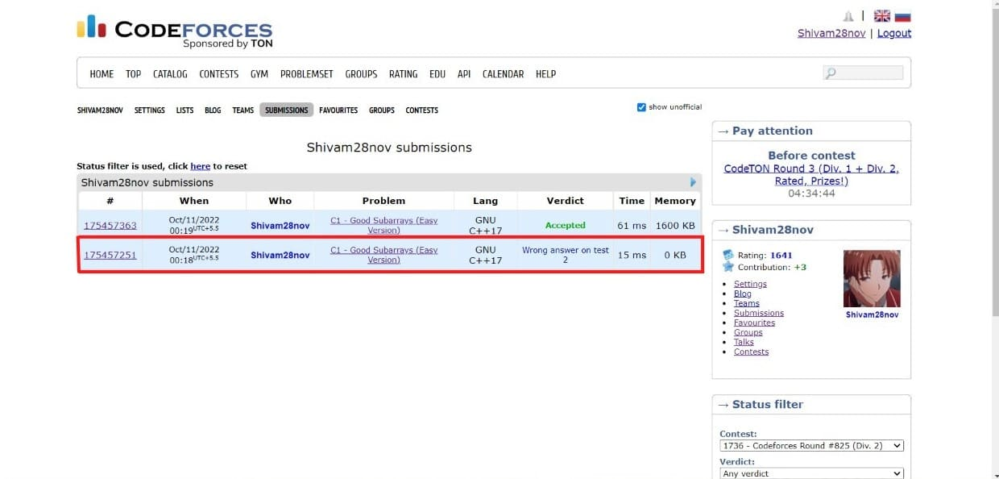
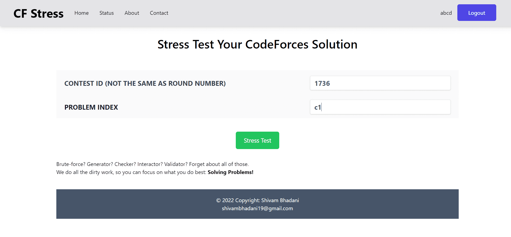
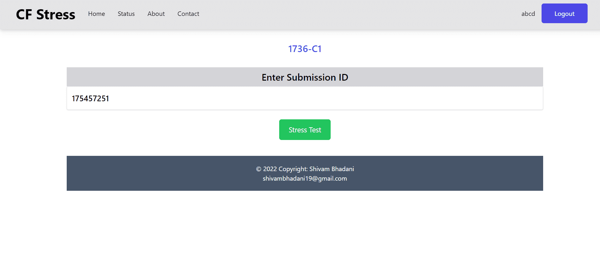
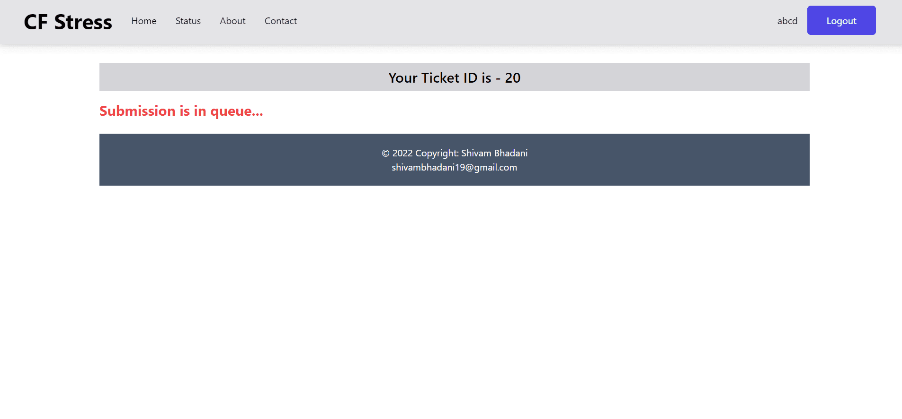
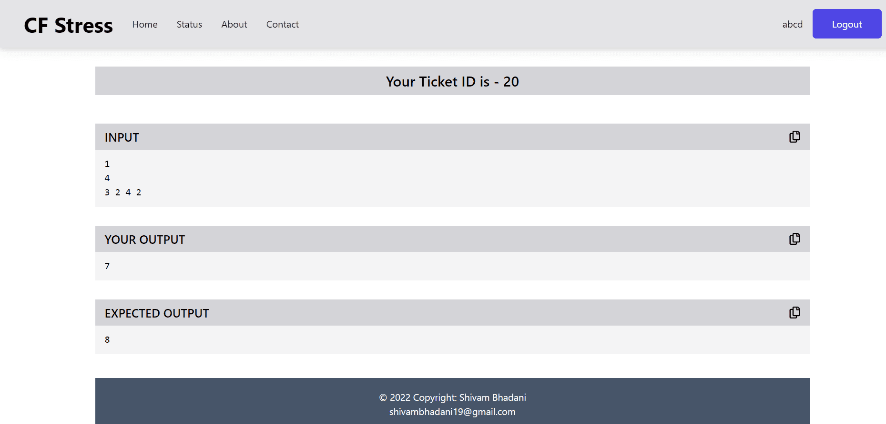

## Setup the frontend of this project from
https://github.com/shivam-bhadani/cf-stress-frontend

# Website Overview
### 1. Wrong answer in some testcase in CodeForces and want to know the counter example

### 2. Enter ContestID and Problem Index

### 3. Plug in the Submission ID

### 4. Wait while the submission is in queue

### 5. Now you get the smallest counter example for the failing submission
